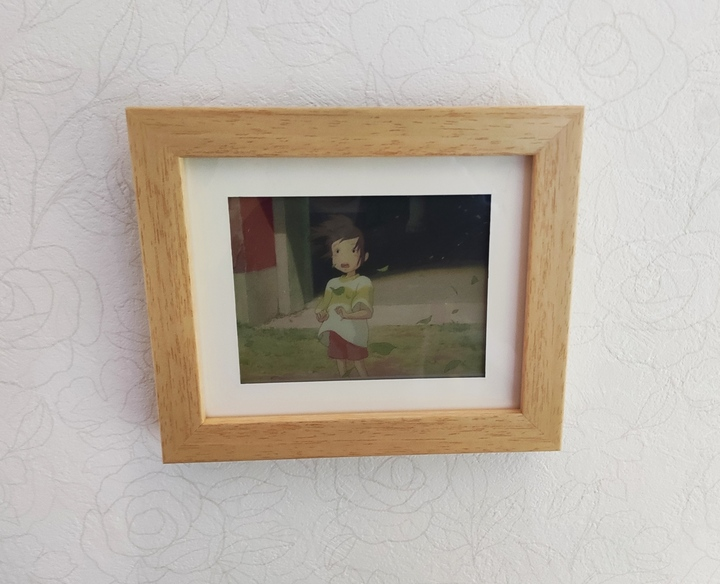
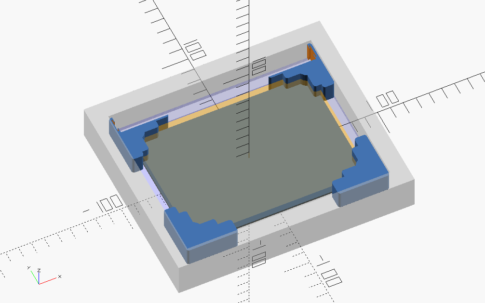

<p align="center">
  
  <p align="center">
  <small>From "Spirited Away (2001)" © 2001 Studio Ghibli・NDDTM.</small>
  </p>
</p>

https://user-images.githubusercontent.com/46628917/185350349-dca5a5df-3bee-4c23-829b-23d41562c1f2.mp4

# slow-movie-player-7c

[](https://github.com/RichardLitt/standard-readme)

Yet another "Slow Movie Player" implementation with 7-color E-Paper module and ESP32.

Features:

- 7-color E-Paper
- microSD (MMC_SD) as the main storage
- Power management by the ESP32 ULP coprocessor
- Battery operated (12 uA @ Deep Sleep. Runs 1.2 years on a 2000 mAh battery.)

## Table of Contents

- [Background](#background)
- [Install](#install)
- [Usage](#usage)
- [Maintainers](#maintainers)
- [Contributing](#contributing)
- [License](#license)

## Background

A few years later from my previous EPD project [SHIHEN](https://github.com/likeablob/shihen), while being impressed on "Slow Movie" and forks ([[1]](https://hackaday.io/project/179122-slow-ish-movie-player), [[2]](https://github.com/TomWhitwell/SlowMovie)), I was wondering it would be fun if I could also have something bigger and more eye-catching than SHIHEN. One day I found a multi-color E-Paper module available and immediately made an impulse buy. At that time, in [Endless Endless Eight](https://github.com/likeablob/endless-endless-eight/) I had just started learning how powerful ESP32 ULP co-processor is, especially for battery-powered devices. So I decided to make a yet another variant of slow movie player by combining the two components.

The 7-color EPD module has notoriously long refresh time (>= 30 sec), however by delegating BUSY signal handlings to the ULP co-processor, the ESP32 module itself can be stay in Deep Sleep at most of the time.

Given the ESP32 module in the Deep Sleep mode only draws a dozen uA (Actually `12 uA` measured = `6 uA for the module` + `6 uA for peripherals`.), [theoretically the device can survive over a year](https://blc.vercel.app/?config=eyJiYXR0ZXJ5Q2FwYWNpdHkiOiIyMDAwIiwic2xlZXBDdXJyZW50TWlsaXMiOjAuMDEyLCJ3YWtlQ3VycmVudE1pbGlzIjoiMzAiLCJ3YWtldXBDb3VudCI6IjEyIiwid2FrZXVwVW5pdCI6ODY0MDAsIndha2V1cFNlYyI6IjMwIn0) under a 2000 mAh rated battery and 2 hours of wake interval.

## Install

### BOM

_WIP_

- ESP32 (ESP-WROOM-32)
- Waveshare ACeP 7-Color E-Paper Display Module (600x448 5.65inch)
- SMD microSD slot
- microSD card
- M2\*5 screws \* 4
- AAA batteries \* 3

### Wire components

See [./kicad](./kicad).

### Print spacers

See [./openscad](./openscad).



### Build firmware

```sh
$ pio run || pio run # The very 1st run may fail due to ulptool-pio
$ pio run -t upload
```

## Usage

### Prepare video file

Your video file must get converted to a special format before being placed on the microSD.
Simply put `1. Dump video frames to a bunch of PNG images.` `2. Apply palette to the images.` `3. Concat the images into a single file.`

You have several options as follows. After obtaining `index.bin` and `images.bin`, place them onto the root of your FAT32-formatted microSD.

#### Option A: With Docker

```sh
$ cd converter
$ cp path/to/your_vid_file .
$ docker-compose run --rm converter your_vid_file
```

#### Option B: With .sh

- Note that you have to install ffmpeg, ImageMagick, node(v16) beforehand.

```sh
$ cd converter
$ ./convert.sh path/to/your_vid_file
```

#### Option C: By your hand

1. Dump video frames into .png files.

```sh
$ cd converter
$ mkdir -p vid

# -r 1/2 == 0.5 FPS
$ ffmpeg -i path/to/your_vid_file -r 1/2 -vf scale=-1:448,crop=600:448 vid/vid_%06d.png
```

As you may have noticed, you can use any kind of image sources here not only usual video files.

2. Reduce colors with the following 7-color palette.  
   

```sh
$ mogrify -monitor -dither FloydSteinberg -remap epaper_7c_palette.png vid/*
```

3. Generate `index.bin` and `images.bin`.

```sh
$ npm ci
$ node generate-index-bin.js vid/
```

### How it works

_WIP_

## Maintainers

[@likeablob](https://github.com/likeablob)

## Contributing

PRs accepted.

Small note: If editing the README, please conform to the [standard-readme](https://github.com/RichardLitt/standard-readme) specification.

## License

MIT
