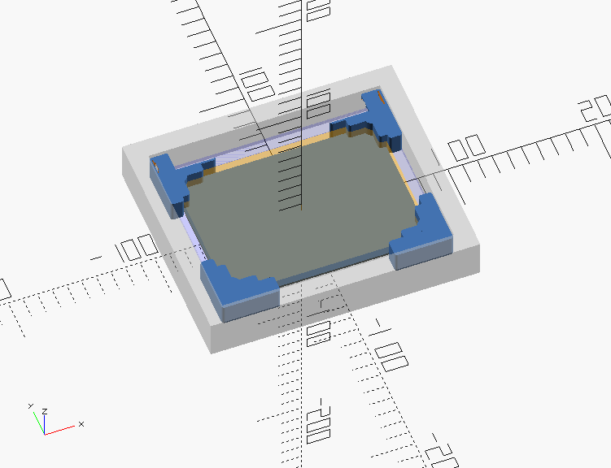
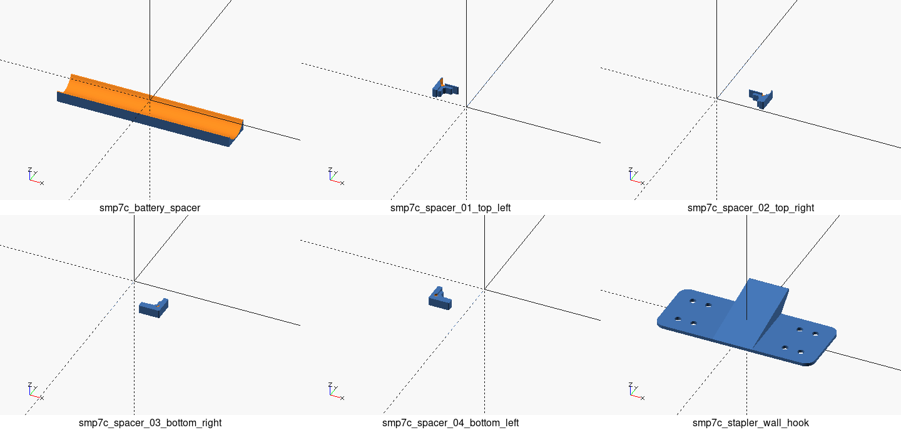

# SMP7C parts

```sh
# Ensure you have submodules
$ git submodule update --init

# Convert *.scad to *.stl
$ make stls

# Generate thumbnails
$ make images
```

All the `*.stl` files are available under [`./stl`](./stl).



## Recommended print configuration

- PLA
- Layer: 0.2 mm

## Parameters

See [`_preview_picture_frame_parameters.scad`](./_preview_picture_frame_parameters.scad) for the details.


